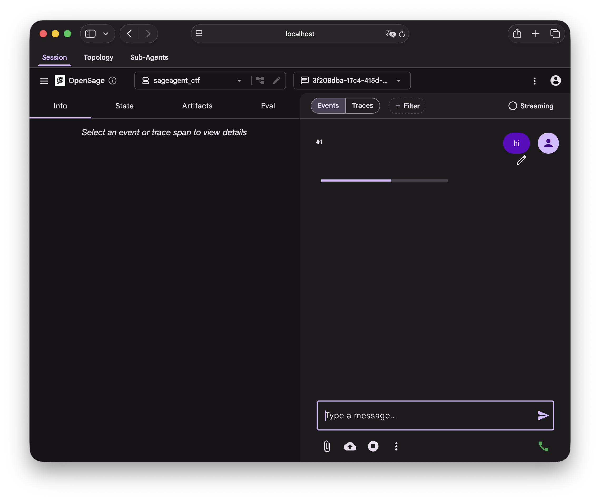

# Quickstart for OpenSage-ADK

This guide shows you how to get up and running with OpenSage-ADK. Before you start, make sure you have the following installed:

- Python 3.12 or later
- `uv` package manager
- Docker for sandbox execution

## Installation

### Step 1: Install `uv` Package Manager

```bash
curl -LsSf https://astral.sh/uv/install.sh | sh
```

### Step 2: Clone and Setup

Clone the repository

```bash
git clone https://github.com/opensage-agent/opensage-adk.git
```

Create virtual environment

```bash
cd opensage-adk
uv venv --python 3.12
```

Install dependencies

```bash
uv sync
```

### Step 3: Verify Installation

Check OpenSage CLI is available

```bash
uv run opensage --help
```

## Creating an Example Agent

This section shows the minimal structure and conventions for writing an agent that OpenSage-ADK can load via `opensage web` and evaluation entry points.

### Step 1: Prepare an Agent Directory Layout

Create a directory for your agent and add an `agent.py` file:

```
my_agent/
└── agent.py
```

### Step 2: Implement a Minimal `agent.py`

The `agent.py` file contains a `mk_agent()` factory function that returns your root agent:

```python title="agent.py"
import os
from typing import Optional

from google.adk.models.lite_llm import LiteLlm

import opensage
from opensage.agents import MemoryManagement, OpenSageAgent


def mk_agent(opensage_session_id: str, model=None):
    session = opensage.get_opensage_session(opensage_session_id)

    if model is None:
        model = LiteLlm(
            model="YOUR_MODEL_NAME",
            api_key=os.environ.get("YOUR_API_KEY"),
        )

    return OpenSageAgent(
        name="my_agent",
        description="My custom OpenSage agent.",
        model=model,
        instruction="You are a helpful assistant.",
        enabled_skills="all",
        memory_management=MemoryManagement.FILE,
        tools=[],
        sub_agents=[],
    )
```

!!! info "API Key Settings"
    If you omit `api_key=...` in `LiteLlm(...)`, LiteLLM will use its default credential resolution from environment variables (for example, `OPENAI_API_KEY` for `openai/...` models and `ANTHROPIC_API_KEY` for `anthropic/...` models).

### Step 3: Run Your Agent with OpenSage-ADK

```bash
uv run opensage web --agent /path/to/my_agent --port 8000
```

Open the web UI at [http://localhost:8000](http://localhost:8000), chat with the agent, and inspect tool calls and session state from there.


<figure markdown="span">
  <figcaption>Run an example agent with OpenSage web interface</figcaption>
</figure>

## What Is Next?

Before diving into more powerful features, familiarize yourself with the [core components](../inside-opensage/components/index.md) of OpenSage-ADK. Reading the [Google ADK documentation](https://adk.dev/) also helps; OpenSage-ADK builds on top of it.

To use all OpenSage-ADK features, see the following sections:

- [Customize Agents](./customize/index.md): Configure your agent to use all OpenSage-ADK features
- [Examples](../inside-opensage/examples/index.md): See more agent patterns and configurations provided by OpenSage

### Customize Your Agent Further

The [Customize Agents](customize/index.md) section is the place to shape an agent to your workload:

- [LLM](customize/llm.md): pick the reasoning model and add profiles for summarization or claim-flagging.
- [Sandbox](customize/sandbox.md): declare the containers your tools run in, and the sidecars (Neo4j, MCP servers) they depend on.
- [MCP Tools](customize/mcp.md): wire in external tool servers over SSE, stdio, or streamable HTTP.
- [History](customize/history.md): keep long runs from overflowing the context window.
- [Plugins](customize/plugins.md): opt in to doom-loop detection, summarization, quota tracking, build verification.
- [Agent Ensembles](customize/agent-ensemble.md), [Neo4j Logging](customize/neo4j.md), [Extra Build](customize/build.md): advanced sections for multi-model fan-out, graph memory, and target compilation.

If you want a single file that uses most of these at once, see the [complete example](customize/complete-example.md).


### Understand How OpenSage-ADK Works

The [Inside OpenSage-ADK](../inside-opensage/components/index.md) section traces each subsystem back to its source under `src/opensage/`. Good starting points:

- [Sessions](../inside-opensage/components/sessions.md): the per-run root object that owns configuration and sandboxes.
- [Sandboxes](../inside-opensage/components/sandbox.md): backend vs initializer, pruning, shared volumes.
- [Tools](../inside-opensage/components/tools.md): how Python functions, MCP toolsets, and bash skills are normalized.
- [Plugins](../inside-opensage/components/plugins.md): the lifecycle pipeline that powers summarization and quota tracking.
- [History](../inside-opensage/components/history.md): truncation vs compaction.
- [Multi-Agent](../inside-opensage/components/multi-agent.md): `AgentTool`, dynamic sub-agents, ensembles, `ToolCombo`.

### Study Production Agents

The [Production Agents](../inside-opensage/examples/index.md) section walks through the agents the OpenSage team runs on SWE-Bench Pro, CyberGym, Harbor, and CTF benchmarks. Each page ships the real `agent.py`, the `config.toml`, and the design rationale.

### Extend the Framework

The [Developer Guide](../developer-guide/adding-tools.md) covers the extension points:

- [Adding Tools](../developer-guide/adding-tools.md): new Python tools, bash skills, or MCP toolsets.
- [Adding Plugins](../developer-guide/adding-plugins.md): new ADK plugins or Claude Code hooks.
- [Customizing Sandbox](../developer-guide/sandbox/index.md): new sandbox types or backends.
- [Evaluations](../developer-guide/evaluation/index.md): running and authoring benchmarks.

### Look Things Up

The [Reference](../reference/opensage-cli.md) section is the place for exact field types, CLI flags, and troubleshooting:

- [CLI Reference](../reference/opensage-cli.md), [`opensage web`](../reference/opensage-web.md), [`dependency-check`](../reference/dependency-check.md).
- [Configuration Reference](../reference/configuration/index.md): every supported field, section by section.
- [Troubleshooting](../reference/troubleshooting.md).

### Get Involved

- [Community](../community/get-involved.md): Discord, issue tracker, discussion.
- [Contributing Guidelines](../community/contributing.md): code style, commit format, PR process.
