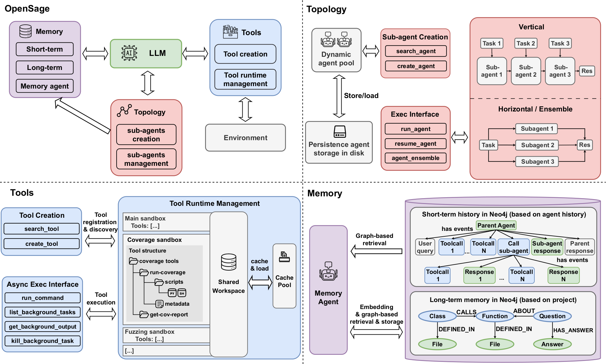

# Roadmap

OpenSage-ADK moves agent development from human-authored, fixed topologies to model-authored, dynamic ones. Where traditional ADK requires a human to predefine every agent structure and tool set before the run starts, OpenSage-ADK lets the model build and manage those structures itself at runtime.

**Agent Development 1.0** (Traditional ADK):

- Human-centric agent construction
- Agent structure is fully predefined by humans and fixed at runtime (topology, workflows, tool sets)
- Limited generalizability and adaptability, requiring extensive human effort

**Agent Development 2.0** (OpenSage-ADK):

- AI-centric agent construction
- Humans provide only minimal scaffolding
- Everything else is dynamically generated and managed by AI at runtime
- Agents can invent new capabilities rather than using the ones defined by humans

<figure markdown="span">
  <figcaption>OpenSage-ADK Technical Overview</figcaption>
</figure>
